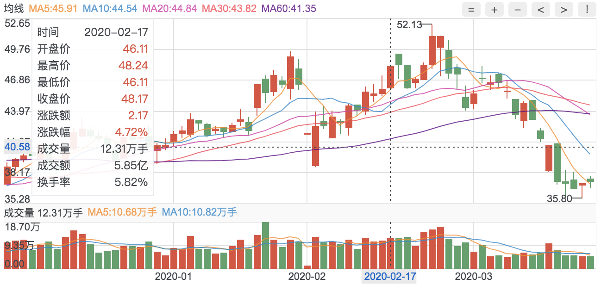

# k-chart

## 简介

`k-chart` —— k线图组件。
- 官网：`--`
- 文档：`--`
- 源码：`--`

特色（推广的一些亮点）



## 安装依赖
```js
npm install
```

## 快速预览
```js
npm run dev
```

### 在浏览器中
```js
http://localhost:8086/kline/base/index.html
```

## 二次开发
```js
npm run dev:umd

npm run build
```


## 交流 & 提问
`(issues 地址)`

## 关于作者

- 个人主页
- 收款二维码

